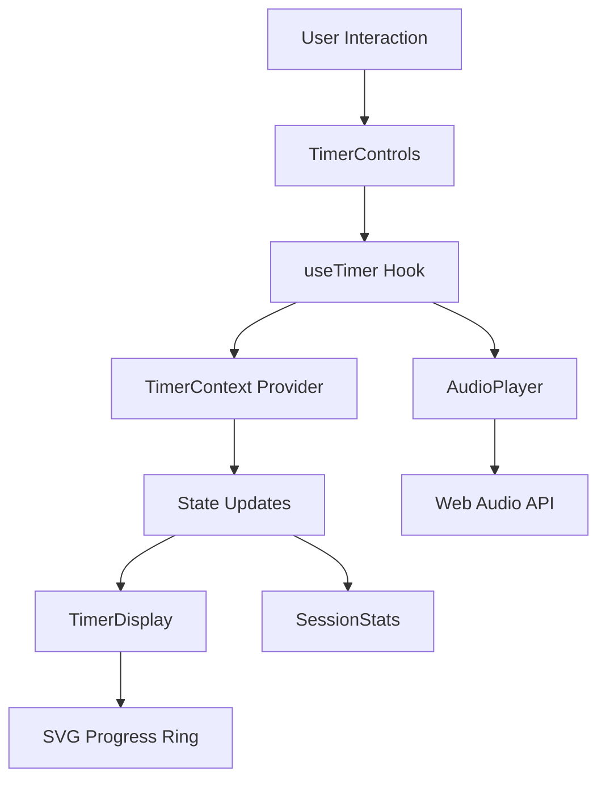

# Pomodoro Timer Web App - Implementation Documentation

## Overview
A modern, responsive Pomodoro Timer web application built with React, TypeScript, and Tailwind CSS. The application provides a clean, intuitive interface for managing work sessions and breaks with customizable settings and audio notifications.

## Architecture

### Files
| File | Purpose |
|------|---------|
| `src/App.tsx` | Main application component with layout and routing |
| `src/components/timer/TimerDisplay.tsx` | SVG-based timer visualization with progress ring |
| `src/components/timer/TimerControls.tsx` | Start/Pause/Reset controls |
| `src/components/timer/SessionTypeSelector.tsx` | Work/Short Break/Long Break session switching |
| `src/components/timer/SessionStats.tsx` | Session completion tracking |
| `src/components/settings/SettingsPanel.tsx` | Audio and duration settings |
| `src/components/settings/DurationControls.tsx` | Individual session duration controls |
| `src/context/timerContext.ts` | Context definition for timer state |
| `src/context/timerProvider.tsx` | Context provider with state management |
| `src/context/timerReducer.ts` | Reducer for state updates |
| `src/hooks/useTimer.ts` | Custom hook for timer logic and audio |
| `src/lib/audio.ts` | Web Audio API implementation for notifications |
| `src/lib/utils.ts` | Utility functions for time formatting and validation |

### Dependencies
- `react` - UI framework
- `react-dom` - DOM rendering
- `tailwindcss` - CSS framework
- `typescript` - Type safety

## Key Components

### TimerDisplay
The core visual component featuring an SVG progress ring that animates as time elapses. The ring uses stroke-dasharray for the progress effect and changes color based on the current session type (Work: Blue, Short Break: Green, Long Break: Gray).

**Key Props**:
- `timeLeft`: Current seconds remaining
- `currentSession`: Session type for color coding
- `isRunning`: Animation state

### TimerControls
Simple Start/Pause/Reset controls with responsive design. The Start button changes to Pause when the timer is running, and Reset clears the current session.

### SessionTypeSelector
Three-button selector for switching between Work, Short Break, and Long Break sessions. Each button reflects the current active session with visual styling.

### SettingsPanel
Collapsible settings panel containing audio toggle and duration controls. Features a modern card-based design with clear labeling and intuitive controls.

## Data Flow

## API Endpoints
This is a client-side application with no server endpoints. All state is managed locally using React Context and localStorage for persistence.

## Configuration

| Setting | Type | Default | Description |
|---------|------|---------|-------------|
| `workDuration` | number | 25 | Work session duration in minutes |
| `shortBreakDuration` | number | 5 | Short break duration in minutes |
| `longBreakDuration` | number | 15 | Long break duration in minutes |
| `audioEnabled` | boolean | true | Enable/disable audio notifications |

## Changelog

### 2025-12-30: Initial Implementation
- **Change**: Complete implementation of all 5 MUS features
- **Reason**: Built a fully functional Pomodoro Timer with modern UI and responsive design
- **Features Implemented**:
  - Core Timer Functionality (P0): SVG progress ring, start/pause/reset controls
  - Session Management (P0): Work/Short Break/Long Break switching with auto-advancement
  - Customizable Timer Settings (P1): Configurable session durations and audio toggle
  - Responsive UI (P0): Mobile-first design with Tailwind CSS
  - Audio Notifications (P1): Web Audio API implementation for session start/end sounds

### 2025-12-30: Component Architecture
- **Change**: Implemented modular component structure with Context API
- **Reason**: Enable state sharing across components while maintaining clean separation of concerns
- **Implementation**: Created dedicated hooks, context providers, and reusable UI components

### 2025-12-30: Audio System
- **Change**: Added Web Audio API for notifications without external dependencies
- **Reason**: Provide rich audio feedback while keeping bundle size minimal
- **Features**: Start sound (ascending tone), end sound (three descending tones), button click sound

### 2025-12-30: Responsive Design
- **Change**: Implemented mobile-first responsive layout with Tailwind CSS
- **Reason**: Ensure optimal user experience across all device sizes
- **Features**: Flexible grid layouts, responsive typography, touch-friendly controls
